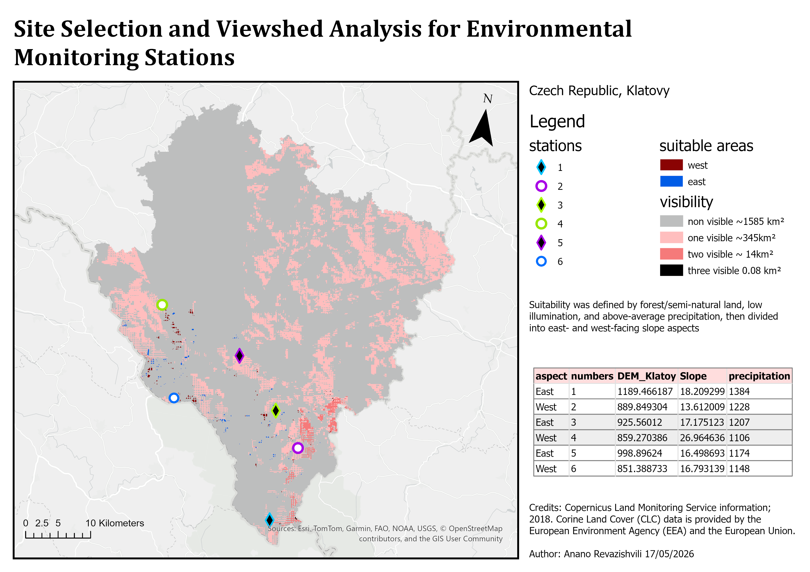

# GIS II Semestral Project — Klatovy, Czech Republic

University semestral project for GIS II (2025/2026). The goal was to apply raster-based GIS analysis to a real study area, covering terrain characterization, land cover analysis, multi-criteria site selection, and viewshed analysis.

**Study area:** Klatovy district, Czech Republic  
**Tools:** ArcGIS Pro  
**Author:** Anano Revazishvili

---

## Project Overview

The project is divided into three parts:

### Part 1 – Data Preparation
Collected and preprocessed all datasets required for analysis:
- Study area boundary (Klatovy district polygon)
- Land Use/Land Cover raster — Corine Land Cover (CLC) 2018, 100 m resolution
- Digital Elevation Model (DEM) — derived from vector contour data provided by CZU
- Precipitation raster — WorldClim average monthly precipitation (1970–2000)

All datasets were reprojected to a unified coordinate system and clipped to the study area boundary.

### Part 2 – Landscape and Terrain Analysis

Derived terrain characteristics from the DEM and related them to land cover classes.

**Terrain layers produced:**
- Slope steepness (classified: Flat 0–5°, Gentle 5–15°, Moderate 15–25°, Steep 25–35°, Very steep 35–45°)
- Terrain orientation / aspect (North, East, South, West, Flat)
- Hillshade / surface illumination

**Key findings:**
- The area transitions from steep southern terrain (where most rivers originate) to flat northern lowlands. Rivers generally flow northward following the overall decrease in slope and relief.
- Agricultural areas dominate the north and central-east on gentler slopes (mean slope ~4.5°), while forests and semi-natural areas occupy the southern and western highlands (mean slope ~8.5°).
- The aspect map shows a varied hilly landscape with slopes facing all directions. South- and west-facing slopes receive more sunlight, while north- and east-facing slopes are cooler and more shaded, creating diverse local microclimates.

**Map output:**

--

### Part 3 – Site Selection for Environmental Monitoring Stations

Identified suitable locations for environmental monitoring stations using multi-criteria analysis, then evaluated station placement through viewshed analysis.

**Suitability criteria (all must be met):**
1. Forest and semi-natural areas (CLC Level 1 = 3)
2. Low illumination (below 50% of the hillshade range within the study area)
3. Above-average precipitation (above 50% of the precipitation range within the study area)

**Station placement:**
Six stations were placed in suitable areas — three on east-facing slopes and three on west-facing slopes — distributed evenly across the study area.

| Station | Aspect | Elevation (m) | Slope (°) | Precipitation (mm) |
|---------|--------|--------------|-----------|-------------------|
| 1 | East | 1189.5 | 18.2 | 1384 |
| 2 | West | 889.8 | 13.6 | 1228 |
| 3 | East | 925.6 | 17.2 | 1207 |
| 4 | West | 859.3 | 27.0 | 1106 |
| 5 | East | 998.9 | 16.5 | 1174 |
| 6 | West | 851.4 | 16.8 | 1148 |

**Viewshed analysis results** (assuming station height 1.7 m):
- Area with no station visible: ~1585 km²
- Area with at least one station visible: ~345 km²
- Area with two stations visible: ~14 km²
- Area with three stations visible: 0.08 km²
- No single location exists from which all six stations are simultaneously visible.

**Map output:**

---

## Data Sources

- **Land cover:** Copernicus Land Monitoring Service — Corine Land Cover (CLC) 2018, European Environment Agency (EEA) / European Union
- **DEM input data:** Vector datasets provided by CZU (Czech University of Life Sciences Prague)
- **Precipitation:** WorldClim v2 — average monthly precipitation 1970–2000
- **Administrative boundaries:** NUTS2 regions of the Czech Republic

---

## Notes

The full project report (PDF) and ArcGIS project package are not included in this repository due to file size. Map layouts are exported as PNG in the `outputs/` folder.
